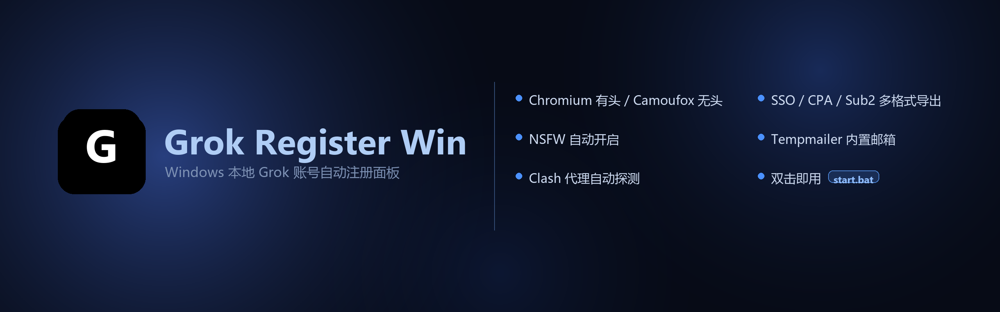

<div align="center">

# Grok Register Win



### Windows 下双击即用的 Grok（xAI）账号自动注册面板

[](https://github.com/lingxiaoyiyu-hub/grok-register-win/releases)
[](LICENSE)
[](#环境要求)
[](https://www.python.org/downloads/)
[](https://github.com/lingxiaoyiyu-hub/grok-register-win/stargazers)
[](https://github.com/lingxiaoyiyu-hub/grok-register-win/releases)
[](https://github.com/lingxiaoyiyu-hub/grok-register-win/network/members)
[](https://github.com/lingxiaoyiyu-hub/grok-register-win/issues)
[](https://github.com/lingxiaoyiyu-hub/grok-register-win/commits)
[](https://github.com/lingxiaoyiyu-hub/grok-register-win/graphs/contributors)

<br>

**代理复用 · 浏览器自动化 · 多邮箱源 · SSO→CPA 转换 · NSFW 自动开启 · 多格式导出**

<br>

基于浏览器自动化完成 Grok 账号注册，自动换取 CPA OAuth 凭证，并开启 NSFW 偏好。支持 Chromium 有头 / Camoufox 无头双引擎切换。

<br>

[📥 快速开始](#快速开始) ·
[✨ 功能特性](#功能) ·
[⚙️ 配置说明](#配置) ·
[📖 目录结构](#目录结构) ·
[❓ 常见问题](#常见问题) ·
[📝 更新日志](#更新日志)

</div>

---

## ⚠️ 免责声明

> 本项目仅供学习研究。自动化注册可能违反平台条款，风险自负。

---

## 📋 目录

- [功能特性](#功能)
- [环境要求](#环境要求)
- [快速开始](#快速开始)
- [配置](#配置)
- [目录结构](#目录结构)
- [常见问题](#常见问题)
- [更新日志](#更新日志)
- [反馈与支持](#反馈与支持)
- [贡献](#贡献)
- [许可证](#license)

---

## ✨ 功能

- **🌐 代理**：复用本机 Clash，自动探测端口（Clash Verge 默认 `7897`）
- **🤖 注册引擎**：Chromium 有头 / Camoufox 无头反检测，面板下拉切换
- **📧 邮箱**：面板下拉多邮箱源（CF Worker / MoeMail / TempMail.lol / DuckMail / GPTMail / LuckMail / MailNest / MaliAPI 等）；公共 Tempmailer 已移除
- **🔄 SSO → CPA**：注册成功后自动把 web SSO 换成 CLIProxyAPI 可用的 OAuth JSON
- **🔞 NSFW 自动开启**：注册成功后自动设置 ToS、生日、NSFW 偏好
- **📦 产物下载**（同一批账号，三种格式，不重复注册/换票）：
  - SSO TXT：`email----password----sso`
  - CPA ZIP：`xai-*.json`（`auth_kind=oauth`，CLIProxyAPI）
  - Sub2 ZIP：`sub2api-data` 官方导入包（单账号 `grok-*.json` + 合集 `all.json`，可一键导入）
- **🗂️ 账号管理**：面板内勾选删除，避免重复下载

---

## 📋 环境要求

| 项 | 说明 |
| :--- | :--- |
| **系统** | Windows 10 / 11 |
| **Python** | 3.10+（安装时勾选 *Add python.exe to PATH*） |
| **代理** | 本机 Clash（Clash Verge / CFW / mihomo 均可），订阅与节点在 Clash 内管理 |
| **浏览器** | Chrome 或 Edge（Chromium 有头引擎默认调用） |
| **Camoufox** | 可选；首次切换会自动下载 Firefox 二进制 |

---

## 🚀 快速开始

1. **下载仓库** ZIP 并解压
2. **打开 Clash**，选一个可用节点
3. **双击 `start.bat`**
   - 首次启动自动创建 `.venv` 并安装依赖，窗口请勿关闭
   - 失败日志见 `data\logs\start.log`
4. **浏览器自动打开** http://127.0.0.1:8787（免密直进）
5. **配置邮箱**：在「邮箱服务」下拉选择邮箱源并填写对应配置，保存
6. **开始注册**：点 **开始注册**
7. **下载产物**：完成后下载 SSO / CPA / Sub2，不需要的账号可勾选删除
   - Sub2：点「下载 Sub2」→ 解压后用 `all.json`（或单个 `grok-*.json`）在 Sub2API「导入数据」上传

> 💡 双击窗口一闪即关：请使用 `start.bat`，并确认 Python 3.10+ 已加入 PATH。

---

## ⚙️ 配置

首次运行从 `config.example.json` 生成 `config.json`。

```json
{
  "proxy": "http://127.0.0.1:7897",
  "allow_proxy_fallback": false,
  "browser_engine": "chromium",
  "email_provider": "cfworker",
  "email_failover": true,
  "cfworker_api_url": "https://apimail.example.com",
  "cfworker_admin_token": "your-admin-token",
  "cfworker_domain": "mail.example.com",
  "register_count": 1,
  "round_timeout_sec": 300
}
```

| 字段 | 说明 |
| :--- | :--- |
| `proxy` | Clash 代理地址；端口不通时启动会自动探测并写回 |
| `allow_proxy_fallback` | 代理失败是否回退直连，默认 `false` |
| `browser_engine` | `chromium`（有头，默认）或 `camoufox`（无头反检测） |
| `email_provider` | 邮箱源 id（如 `cfworker` / `moemail` / `tempmail_lol` / `luckmail` / `mailnest`） |
| `cfworker_api_url` | CF Worker / 自建 API 根地址（选 cfworker 时） |
| `cfworker_admin_token` | 管理 Token |
| `cfworker_domain` | 邮箱域名 |
| `email_failover` | 邮箱失败时是否切换备用源 |
| `register_count` | 单次任务注册数量 |
| `round_timeout_sec` | 单账号整轮硬超时（秒），默认 `300`；超时杀进程并进入下一轮 |

完整字段见 `config.example.json`（含 MoeMail / DuckMail / LuckMail / MailNest / GPTMail 等）。

### 📧 邮箱（重要）

> **内置公共 Tempmailer 已移除。**
> 因大规模滥用，公共临时邮可能拒收 xAI 验证码（提示类似：
> `Due to recent large-scale abuse, emails from xAI are temporarily not accepted.`）

面板「邮箱服务」下拉可选（对齐 any-auto-register 接码体系）：

| 标识 | 名称 | 说明 |
| :--- | :--- | :--- |
| `cfworker` | CF Worker / 自建域名 | **推荐**，需 API URL + Admin Token |
| `cloudflare` | cloudflare_temp_email | 自建兼容接口（路径可配） |
| `moemail` | MoeMail | 临时邮 API（sall.cc 等） |
| `tempmail_lol` | TempMail.lol | 免 key 自动生成（可能被 xAI 拒） |
| `duckmail` | DuckMail | 临时邮 |
| `gptmail` | GPTMail | 第三方 API |
| `maliapi` | YYDS / MaliAPI | 接码/邮箱 API |
| `luckmail` | LuckMail | 接码/买邮平台 |
| `mailnest` | MailNest | [mailnest.top](https://mailnest.top/buy-email) 临时邮/专属邮，Grok 项目代号 `x-ai001` |
| `skymail` / `cloudmail` | SkyMail / CloudMail | API + Token/账号 |
| `freemail` | Freemail | 自建 |
| `opentrashmail` | OpenTrashMail | 自建/开源 |
| `laoudo` | Laoudo | 固定邮箱 |

收码流程：申请邮箱 → 快照旧信 `before_ids` → 轮询收信 → 提取 Grok 验证码（`ABC-DEF`）。

**建议优先自建（cfworker / cloudflare_temp_email）**；公共源仅作备选，不保证能收 xAI 信。

### 🌍 环境变量（高级）

| 变量 | 含义 | 默认 |
| :--- | :--- | :--- |
| `PANEL_AUTH` | 是否开启登录（`1` 开启） | `0`（免密） |
| `PANEL_PASSWORD` | 登录密码（仅 `PANEL_AUTH=1` 生效） | `admin` |
| `PANEL_PORT` | 面板端口 | `8787` |
| `GROK_PROXY` | 覆盖 `config.json` 代理 | — |
| `ROUND_TIMEOUT_SEC` | 覆盖 `round_timeout_sec`（单轮硬超时秒数） | `300` |

面板默认仅监听 `127.0.0.1` 且免密。需加密码时：

```powershell
$env:PANEL_AUTH="1"
$env:PANEL_PASSWORD="你的密码"
.\start.bat
```

---

## 📂 目录结构

```
grok-register-win/
├── start.bat                 # 双击启动
├── launcher.py               # 启动器（代理探测、Playwright 修补）
├── grok_register_ttk.py      # 注册主程序
├── config.example.json
├── panel/app.py              # Web 面板
├── lib/
│   ├── sso2cpa_core.py       # SSO → CPA 转换核心
│   ├── mailbox_core.py       # 统一收码 / Grok 提码
│   ├── mail_providers.py     # 多邮箱源适配与下拉
│   ├── base_mailbox.py       # any-auto-register 邮箱实现
│   ├── luckmail/             # LuckMail SDK
│   ├── camoufox_backend.py   # Camoufox 无头适配层
│   └── patch_playwright.py   # Playwright 驱动崩溃自动修补
├── data/
│   ├── logs/                 # 运行日志
│   └── cpa/                  # 已转换 CPA JSON
├── docs/                     # 截图与文档
└── accounts_*.txt            # 注册产出
```

---

## ❓ 常见问题

<details>
<summary><b>🔧 代理端口不通 / WinError 10061</b></summary>
<br>

- 确认 Clash 已启动
- Clash Verge 默认端口 `7897`
- 修改 `config.json` 的 `proxy` 后重启 `start.bat`（启动会自动探测）
</details>

<details>
<summary><b>⚠️ 注册大量失败 / 验证码或页面异常</b></summary>
<br>

- **绝大多数失败来自网络环境**，不是脚本本身
- 实测机场节点里 **日本** 更稳；新加坡 / 美国 / 德国成功率偏低
- 失败时先在 Clash 换日本节点，再点「开始注册」
- 面板「启动注册」卡片下也有同样提示
</details>

<details>
<summary><b>🍪 卡在 Cookie / 拿不到 SSO</b></summary>
<br>

- 已自动点击「接受所有 Cookie」
- 仍失败请换节点重试（优先日本）
</details>

<details>
<summary><b>📧 邮箱设置保存失败</b></summary>
<br>

- 请使用 **v1.2.0+**，并强制刷新面板（Ctrl+F5）
- 旧版若残留重复 `saveEmailConfig` 会把所有源保存成 custom 导致失败
- 选 CF Worker / LuckMail / MailNest 等需填写对应 API/Key；TempMail.lol / MoeMail 可先空 Key 保存
</details>

<details>
<summary><b>🔏 验证码收不到 / xAI 拒信</b></summary>
<br>

- 公共临时邮可能直接拒收 xAI 邮件
- 换 **CF Worker 自建域名** 或其它可用源后重试
- 节点优先日本
</details>

<details>
<summary><b>📦 依赖安装失败</b></summary>
<br>

```bat
.venv\Scripts\python.exe -m pip install -r requirements.txt -i https://pypi.tuna.tsinghua.edu.cn/simple
```
</details>

---

## 📝 更新日志

<details>
<summary><b>查看完整更新日志</b></summary>

### v1.2.0（2026-07-18）
- **多邮箱源下拉（重大更新）**：接入 any-auto-register 邮箱/接码体系
  - CF Worker、cloudflare_temp_email、MoeMail、TempMail.lol、DuckMail、GPTMail
  - MaliAPI(YYDS)、LuckMail、SkyMail、CloudMail、Freemail、OpenTrashMail、Laoudo
- **移除内置 Tempmailer**：公共源滥用后拒收 xAI 验证码，面板展示说明
- **收码流程对齐 any-auto-register**：`before_ids` 忽略旧信、`otp_sent_at` 过滤发码前邮件、统一提取 Grok `ABC-DEF` 验证码
- 新增 `lib/base_mailbox.py` / `lib/mail_providers.py` / `lib/mailbox_core.py` / `lib/luckmail/`
- 修复面板「保存邮箱设置」失败：删除重复旧版 `saveEmailConfig` 覆盖问题
- 未配置完整邮箱源时，注册启动前明确提示并失败，避免空跑

### v1.1.0（2026-07-16）
- 修复 SSO→CPA 失败：`curl_cffi` 固定 `chrome131` 指纹被 Cloudflare 403 拦截，导致 `authorize 未进入 consent 页`
- 启动时自动选择可用 TLS impersonate（优先 `chrome136`，并回退其它配置文件）
- 识别 Cloudflare 拦截时输出明确错误（HTTP 状态 + impersonate），便于排查

### v1.0.10（2026-07-16）
- 修 Playwright/Camoufox 提交后崩溃：补全 `pageError.location` 补丁（1.60 有多处未覆盖）
- Cookie 弹窗 `page_eval` 超时改为短超时软失败，不再卡死 60 秒
- 修正 GeoIP 模块名（`camoufox.locales`），优先使用较新的 Camoufox 152 二进制

### v1.0.9（2026-07-16）
- 修复面板日志把 Camoufox 业务日志误过滤，导致"像卡住没输出"
- Camoufox 首次下载浏览器**不计入** 5 分钟注册超时；下载进度会显示在日志
- 启动注册前先检查/准备 Camoufox，失败时给出明确提示

### v1.0.8（2026-07-16）
- 单账号整轮硬超时默认 **5 分钟**（`round_timeout_sec` / `ROUND_TIMEOUT_SEC`）：卡住自动杀进程并进入下一轮
- 已注册成功后若在后续步骤超时，仍记为成功（避免白注册）
- 每轮结束扫描新账号文件并入队 CPA，降低漏转换
- 面板不再把 `config.json` 的 `register_count` 强行改成 1（用环境变量控制单轮）

### v1.0.7（2026-07-16）
- 新增「下载 Sub2」：从已转换 CPA 现场映射为 Sub2API 官方导入包（`type=sub2api-data` / `version=1`）
- 主页三种产物并列：SSO TXT、CPA ZIP、Sub2 ZIP（不重跑注册/换票）
- Sub2 ZIP 对齐 CPA：`README.txt` + 单账号 `grok-*.json` + 合集 `all.json`
- 映射字段：`expired`→`credentials.expires_at`，`platform=grok`，`type=oauth`，`proxies=[]`
- Sub2 按钮样式与 SSO/CPA 同为渐变实心按钮
- 启动注册区增加网络提示（日本节点更稳）；邮箱区空 hint 自动隐藏；README FAQ 补充节点建议
- 仓库横幅更新：卖点改为「SSO / CPA / Sub2 多格式导出」

### v1.0.6（2026-07-16）
- 修复 CPA 转换在中文路径下失败：curl_cffi 无法处理非 ASCII CA 证书路径，启动时自动复制到 `%TEMP%`
- 面板 UI 美化：Grok 风格 logo（黑底白字）、卡片渐变指示条、按钮/表格悬停效果
- 运行日志过滤：去重复时间戳、过滤 Cloudflare 轮询刷屏、去重信息行、超长截断
- 免密模式启动不再显示误导性密码提示

### v1.0.5（2026-07-16）
- 修复 CPA 转换 404：consent 提交改为标准 HTML 表单 POST，从 302 重定向提取 OAuth code
- 修复 Windows GBK 编码崩溃：入口文件强制 UTF-8 输出
- 修复 Playwright 驱动崩溃：新增 `lib/patch_playwright.py` 启动时自动修补
- 扩展注册提交按钮检测（`<a>` 标签 + 更多文本模式）
- Camoufox 浏览器崩溃快速失败，避免反复超时

### v1.0.4（2026-07-16）
- 新增 Camoufox 无头引擎（基于 Firefox 反检测，GeoIP 自动对齐时区/语言）
- 面板下拉切换 Chromium 有头 / Camoufox 无头
- 首次使用自动下载 Firefox 二进制与 GeoLite2 数据库

</details>

---

## 💬 反馈与支持

| 类型 | 途径 |
| :--- | :--- |
| 🐛 **Bug 反馈** | 提交 [Issue](https://github.com/lingxiaoyiyu-hub/grok-register-win/issues/new?template=bug_report.yml) |
| 💡 **功能建议** | 提交 [Issue](https://github.com/lingxiaoyiyu-hub/grok-register-win/issues/new?template=feature_request.yml) |
| ❓ **使用提问** | 在 [Discussions](https://github.com/lingxiaoyiyu-hub/grok-register-win/discussions) 中讨论 |

---

## 🤝 贡献

欢迎各种形式的贡献！

- 🐛 提交 Bug 反馈
- 💡 提出功能建议
- 📝 改进文档
- 🔧 提交代码 PR

请在参与前阅读 [贡献指南](CONTRIBUTING.md) 和 [行为准则](CODE_OF_CONDUCT.md)。

---

## License

本项目基于 [MIT License](LICENSE) 发布。若上游组件另有协议，以对应文件为准。

---

<div align="center">

**如果这个项目对你有帮助，欢迎 Star ⭐ 支持一下**

<br>

<a href="https://github.com/lingxiaoyiyu-hub/grok-register-win/stargazers">
  
</a>
&nbsp;
<a href="https://github.com/lingxiaoyiyu-hub/grok-register-win/network/members">
  
</a>
&nbsp;
<a href="https://github.com/lingxiaoyiyu-hub/grok-register-win/watchers">
  
</a>

</div>
